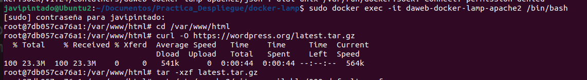

# daweb-docker-lamp
Proyecto para la instalación de LAMP a través de contenedores Docker

```
docker-lamp
├─ .gitignore 
├─ LICENSE
├─ README.md
├─ apache2-php
│  ├─ Dockerfile
│  ├─ conf
│  │  ├─ 000-default.conf
│  │  ├─ intranet.conf
│  │  └─ javier-pintado-phpmyadmin.conf
│  ├─ etc
│  │  └─ apache2
│  └─ www
│     ├─ index.html
│     ├─ intranet
│     │  └─ index.html
│     ├─ phpinfo.php
│     └─ test-bd.php
├─ dist
│  ├─ env.dist
│  └─ htpasswd.dist
├─ docker-compose.yml
├─ docs
│  └─ images
└─ mysql
   ├─ conf
   └─ dump
      └─ myDb.sql


```

La estructura del proyecto `docker-lamp` es un entorno de desarrollo LAMP (Linux, Apache, MySQL, PHP) utilizando Docker. A continuación, se describen cada parte de la estructura:
# Estructura del Proyecto

- **.gitignore**: Archivo que especifica qué archivos o carpetas deben ser ignorados por Git, como configuraciones personales o archivos de compilación.

- **LICENSE**: Contiene información sobre la licencia bajo la cual se distribuye el proyecto.

- **README.md**: Documentación del proyecto, incluyendo descripciones, instrucciones de instalación y uso, y créditos.

- **apache2-php/**: Carpeta que contiene archivos relacionados con el servidor web Apache y PHP.
  - **Dockerfile**: Script de instrucciones para construir la imagen Docker del servidor Apache con PHP.
  - **conf/**: Archivos de configuración para Apache.
    - **000-default.conf**: Configuración predeterminada del Virtual Host para Apache.
    - **intranet.conf**: Configuración del Virtual Host para la intranet.
    - **javier-pintado-phpmyadmin.conf**: Configuración del Virtual Host para phpMyAdmin.
  - **etc/apache2/**: Archivos de configuración adicionales para el directorio apache2.
  - **www/**: Directorio que almacena archivos del sitio web.
    - **index.html**: Página de inicio del sitio principal.
    - **intranet/**: Carpeta con archivos para la sección de intranet del sitio.
      - **index.html**: Página de inicio de la intranet.
    - **phpinfo.php**: Script PHP para mostrar información sobre la configuración de PHP.
    - **test-bd.php**: Script PHP para probar la conexión a la base de datos MySQL.

- **dist/**: Contiene plantillas o archivos distribuibles, como una versión de ejemplo del archivo .env.
  - **env.dist**: Plantilla para el archivo de variables de entorno.
  - **htpasswd.dist**: Plantilla con usuario de ejemplo para acceder a la intranet.

- **docker-compose.yml**: Archivo YAML que define servicios, redes y volúmenes para el proyecto mediante Docker Compose.

- **docs/**: Directorio destinado a contener documentación del proyecto.
  - **images/**: Imágenes utilizadas en la documentación.

- **mysql/**: Contiene configuraciones y datos relacionados con el servicio de base de datos MySQL.
  - **conf/**: Directorio para archivos de configuración personalizados de MySQL.
  - **dump/**: Contiene archivos de carga de bases de datos, como scripts SQL para inicializar la base de datos.
    - **myDb.sql**: Script SQL para inicializar la base de datos.


# Guía de Instalación del Proyecto Docker LAMP

Esta guía detalla los pasos para clonar y configurar un entorno Docker LAMP (Linux, Apache, MySQL, PHP) con Virtual Hosts.

## Clonar el Repositorio

Primero, clonar el repositorio Git:

```bash
git clone https://github.com/antonio-gabriel-gonzalez-casado/docker-lamp/
cd docker-lamp
```


##  Configurar Archivo .env

Copiar el archivo env.dist a .env y personaliza las variables de entorno:

```bash
cp dist/env.dist .env
```


Editar el archivo .env estableciendo los siguientes valores:

```
MYSQL_DATABASE=dbname
MYSQL_USER=root
MYSQL_PASSWORD=test
MYSQL_ROOT_PASSWORD=test
MYSQL_PORT=3307
```


Copiar el archivo htpasswd.dist a ./apache2-php/etc/apache2/ y añade usuarios para acceder a la intranet:

```bash
cp dist/htpasswd.dist ./apache2-php/etc/apache2/.htpasswd
```


Los usuarios tiene el formato:
```
usuario:contraseña
```
La constraseña la he generado con el siguiente comando:

```bash
htpasswd ./apache2-php/etc/apache2/.htpasswd javier-pintado
```


## Construir las Imágenes

Construir las imágenes usando Docker Compose:

```bash
docker-compose build
```


## Iniciar los Contenedores

Arrancar los contenedores en modo detached:

```bash
docker-compose up -d
```


## Comprobaciones de Prueba

### Creación de un usuario adicional para acceder a la intranet:
Para acceder a al intranet se necesita crear un archivo .htpasswd con los nombres de usuario y sus contraseñas. Se puede usar la herramienta htpasswd para esto. Para ello accede al contenedor daweb-docker-lamp-apache2 a través del terminal mediante el siguiente comando:

```
docker exec -it daweb-docker-lamp-apache2 /bin/bash
```

Lanzar el comando que crea un usuario llamado usuario2 y pedirá que se introduzca una contraseña:
```
htpasswd /etc/apache2/.htpasswd usuario2
```


### Prueba de los servicios:
Para probar si los servicios están funcionando correctamente, acceder a los siguientes enlaces a través del navegador:

- **Prueba del sitio principal**: [http://localhost](http://localhost)
  
- **Prueba de la intranet**: [http://localhost:8060 (usando usuario1 y contraseña:123456789 o el usuario creado en el paso anterior)](http://localhost:8060)
  
- **Prueba de PHP Info**: [http://localhost/phpinfo.php](http://localhost/phpinfo.php)
  
- **Prueba de Conexión a la Base de Datos**: [http://localhost/test-bd.php](http://localhost/test-bd.php)
  
- **Prueba de phpmyadmin**: [http://localhost:8080 (con el usuario root y la contraseña establecida)](http://localhost:8080)
  
  


## Detener los Contenedores
Para detener y eliminar los contenedores:

```bash
docker-compose down
```

## Modifica el nombre de los virtualhost

Abrimos el archivo default.conf para editarlo.

```bash
nano apache2-php/conf/000-default.conf 
```

Cambiamos www.local a javier-pintado-www.local


Ahora abrimos el archivo intranet.conf para editarlo. 

```bash
nano apache2-php/conf/intranet.con
```

Cambiamos intranet.local a javier-pintado-intranet.local


## Crear un nuevo virtual host para el servicio phpmyadmin

Cremos el archivo de configuración para phpMyAdmin:

```bash
nano apache2-php/conf/javier-pintado-phpmyadmin.conf
```

Agregamos el siguiente contenido al archivo, siguiendo las especificaciones indicadas:

```
<VirtualHost *:8081>
    ServerName javier-pintado-phpmyadmin.local

    <Location />
        AuthType Basic
        AuthName "Acceso restringido"
        AuthUserFile /etc/apache2/.htpasswd
        Require valid-user
    </Location>

    ProxyPreserveHost On
    ProxyPass / http://phpmyadmin:80/
    ProxyPassReverse / http://phpmyadmin:80/
</VirtualHost>
```


Abrimos el archivo apache2-php/Dockerfile para agregar las líneas necesarias para habilitar los módulos de proxy inverso:

```bash
nano apache2-php/Dockerfile
```

Añadiremos las siguientes lineas: 

```
# Activar el módulo de configuración del Virtual Host de phpMyAdmin
RUN a2ensite javier-pintado-phpmyadmin.conf
# Habilitar módulos de proxy inverso
RUN a2enmod proxy proxy_http
```


Reconsutruimos las imagenes:

```bash
docker-compose build
```


Después de la reconstrucción, reinicia los contenedores:

```bash
docker-compose up -d
```


## Modificación del index.html de la intranet

Abrimos el archivo index.html de la intranet:

```bash
nano apache2-php/www/intranet/index.html
```

Cambia el contenido del archivo con el código HTML de la nueva apariencia. Puedes copiar un código HTML de alguna plantilla "copyleft o free" que encuentres en Internet.


## Añadir un nuevo usuario a la lista de usuarios que puede acceder a la intranet

Añadimos un nuevo usuario y le asignaremos la contraseña:

```bash
htpasswd apache2-php/etc/apache2/.htpasswd javier-pintado
```

:

## Instalación de un CMS Wordpress

Utilizaremos Docker para acceder al contenedor del servicio web donde está corriendo Apache y PHP.

```bash
docker exec -it daweb-docker-lamp-apache2 /bin/bash
```

Dentro del contenedor, navega al directorio donde se encuentra el sitio web.

```bash
cd /var/www/html
```

Descarga la última versión de WordPress:

```bash
curl -O https://wordpress.org/latest.tar.gz
```

Descomprime el archivo descargado:

```bash
tar -xzf latest.tar.gz
```




Entra al directorio de WordPress:

```bash
cd /var/www/html/wordpress
```

Copia el archivo de configuración de ejemplo:

```bash
cp wp-config-sample.php wp-config.php
```

Abre el archivo de configuración en un editor de texto para editarlo:

```bash
nano wp-config.php
```

Configura la base de datos proporcionando la información correcta en las siguientes líneas:

```
define( 'DB_NAME', 'myDb' );
define( 'DB_USER', 'root' );
define( 'DB_PASSWORD', 'root' );
define( 'DB_HOST', 'localhost' );
```


## Instalación de Certificados SSL

### Generación de Certificados

Crear un directorio llamado certs en el directorio raiz del proyecto para almacenar los certificados.

Se puede usar el comando:

```bash
mkdir certs
cd certs
```

Lanzar el comando de generación de certificados de openssl:

```bash
openssl req -x509 -nodes -days 365 -newkey rsa:2048 -keyout www.key -out www.crt
openssl req -x509 -nodes -days 365 -newkey rsa:2048 -keyout intranet.key -out intranet.crt
openssl req -x509 -nodes -days 365 -newkey rsa:2048 -keyout nombre-apellidos-phpmyadmin.key -out nombre-apellidos-phpmyadmin.crt

```

Este comando crea un certificado (crt) y una clave privada (key) válidos por 365 días.
- x509: Especifica que quieres generar un certificado autofirmado.
- nodes: Crea una clave sin contraseña.
- days 365: El certificado será válido por 365 días.
- newkey rsa:2048: Crea una nueva clave de 2048 bits.
- keyout: El nombre del archivo para la clave privada (normalmente será el nombre del dominio)
- out: El nombre del archivo para el certificado (normalmente será el nombre del dominio)

Durante el proceso, se piden detalles como país, estado, organización, etc. 

Para Common Name (Introducir el nombre del dominio www.local, intranet.local).


### Configurar Virtual Host 443

En cada archivo de configuración agregar una regla como esta replicando la configuración adicional de la ya existente:

```
<VirtualHost *:443>
    ServerName www.local
    SSLEngine on
    SSLCertificateFile /etc/apache2/ssl/www.crt
    SSLCertificateKeyFile /etc/apache2/ssl/www.key
</VirtualHost>

<VirtualHost *:443>
    ServerName intranet.local
    SSLEngine on
    SSLCertificateFile /etc/apache2/ssl/intranet.crt
    SSLCertificateKeyFile /etc/apache2/ssl/intranet.key
</VirtualHost>

<VirtualHost *:443>
    ServerName javier-pintado-phpmyadmin.local
    SSLEngine on
    SSLCertificateFile /etc/apache2/ssl/javier-pintado-phpmyadmin.crt
    SSLCertificateKeyFile /etc/apache2/ssl/javier-pintado-phpmyadmin.key
</VirtualHost>

```


### Habilitar el módulo mod_ssl

En el Dockerfile de apache2-php se deben copiar los certificados generados, para ello añade la siguiente línea:

```
# Copiar archivos de contraseñas
COPY ./certs /etc/apache2/ssl
```

Además se debe habilitar el módulo ssl, para ello agregar la siguiente línea:

```
RUN a2enmod ssl
```


